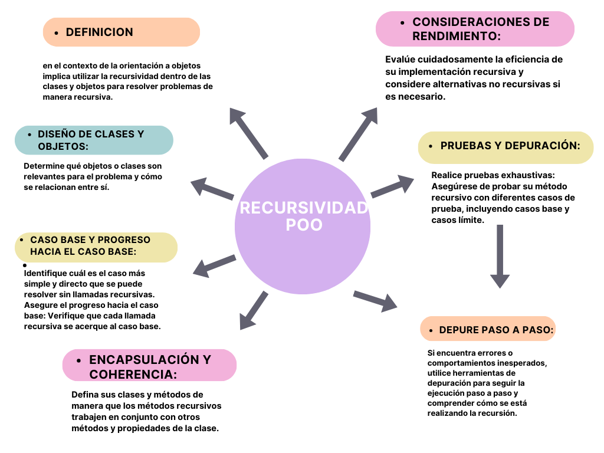

# Act1 Ejercicio 4 Recursividad-POO

  

Ejemplo de codigo recursividad

function factorial(n) {
  // Caso base: si el número es 0 o 1, el factorial es 1
  if (n === 0 || n === 1) {
    return 1;
  }

  // Llamada recursiva: calcula el factorial del número anterior y multiplica por n
  return n * factorial(n - 1);
}